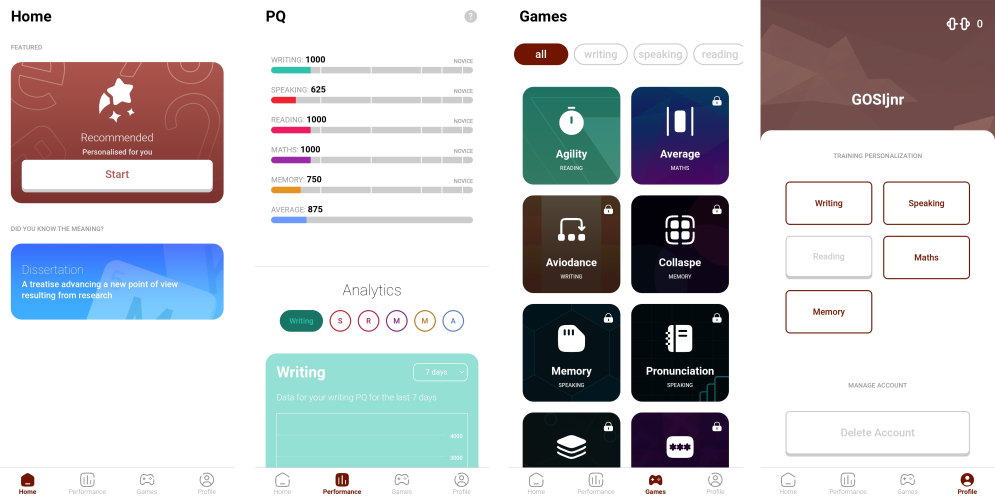

# esut-brain-trainer

**ESUT Brain Trainer** is a mobile app designed to improve cognitive skills through fun, interactive quizzes and games. Built as a final year project at ESUT (Enugu State University of Science and Technology), the app features logic, math, memory, and vocabulary challenges to help users train their brain and track progress over time.

---

## Table of Contents

- [Features](#features)
- [Screenshots](#screenshots)
- [Installation](#installation)
- [Usage](#usage)
- [Coding Conventions](#coding-conventions)
- [Note](#note)

---

## Features

- Interactive brain training exercises and games
- Static/explicit typing for all variables and functions
- Descriptive variable and method names
- Consistent and clear naming conventions

---

## Screenshots

Below is a screenshots of the main menu UI:



---

## Installation

1. **Clone the repository:**
   ```bash
   git clone https://github.com/GOSIjnr/esut-brain-trainer.git
   cd esut-brain-trainer
   ```

2. **Import in Godot:**
   - Open Godot and import the project by selecting `File > Import Project...` and navigating to the `esut-brain-trainer` directory.

---

## Usage

To start the application, run the code from the Godot engine. Once the app is running, you can start the training session by following the on-screen instructions. The app will guide you through various cognitive exercises and provide feedback on your progress. You can also access a leaderboard to see how you rank against other users. Enjoy your brain training journey!

---

## Coding Conventions

To ensure code quality and maintainability, the following conventions are used throughout the codebase:

- **Static/Explicit Typing:**
  All variables, function parameters, and return types must have explicit type annotations.
  ```GDScript
	func updateStartButton(color :Color) -> void:
		var darken := 0.15

		var styleBoxflat = StyleBoxFlat.new()
		styleBoxflat.bg_color = color
		styleBoxflat.corner_detail = 12
		styleBoxflat.border_width_bottom = 15
		styleBoxflat.border_color = color.darkened(darken)
		styleBoxflat.set_corner_radius_all(20)

		var styleBoxclicked = StyleBoxFlat.new()
		styleBoxclicked.bg_color = color.darkened(darken)
		styleBoxclicked.corner_detail = 12
		styleBoxclicked.set_corner_radius_all(20)

		startButton.add_theme_stylebox_override("hover", styleBoxflat)
		startButton.add_theme_stylebox_override("normal", styleBoxflat)
		startButton.add_theme_stylebox_override("pressed", styleBoxclicked)
  ```

---

## Note

This project was built using Godot 4.x and combines Godot's built-in features with custom scripts.

It is important to note that this was my first time using Godot, so I was learning the engine and GDScript as I developed the project.
Due to strict time constraints, I did not have the opportunity to design a proper, well-structured codebase—most of the work was done on the fly, balancing both learning and coding simultaneously.

Thank you for understanding, and I hope this project is helpful or inspiring to others who are new to Godot or game development!

---

**Happy brain training!**
